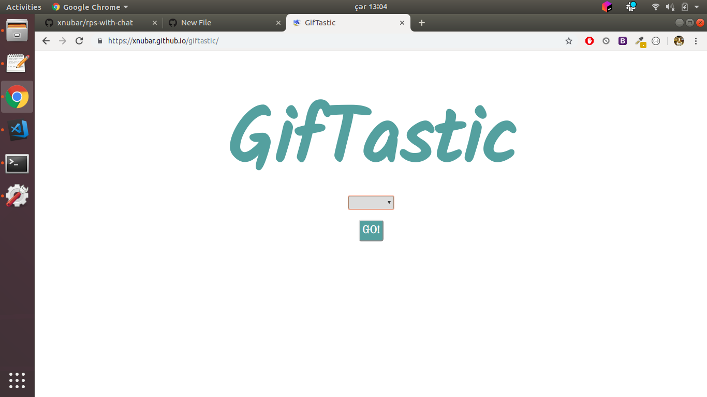
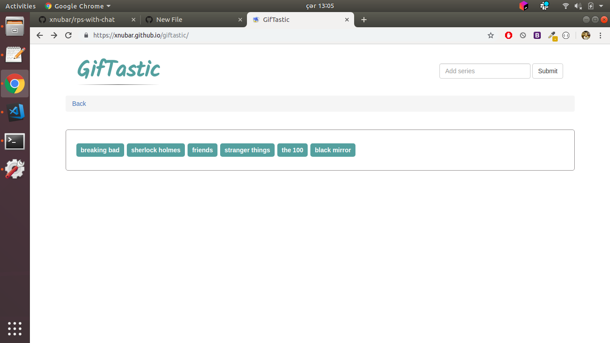
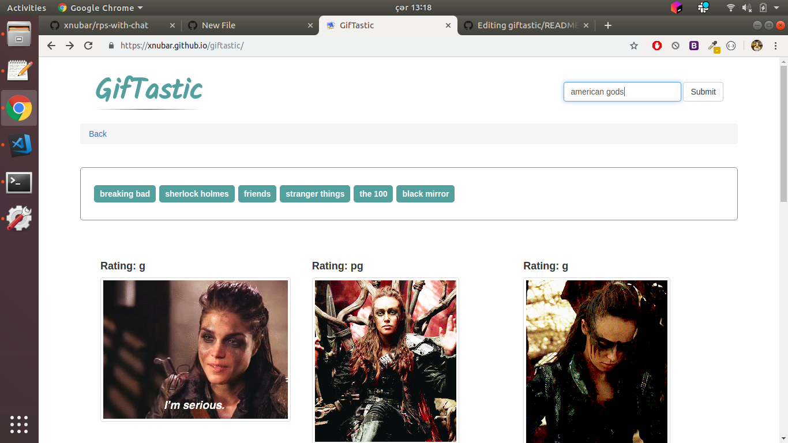
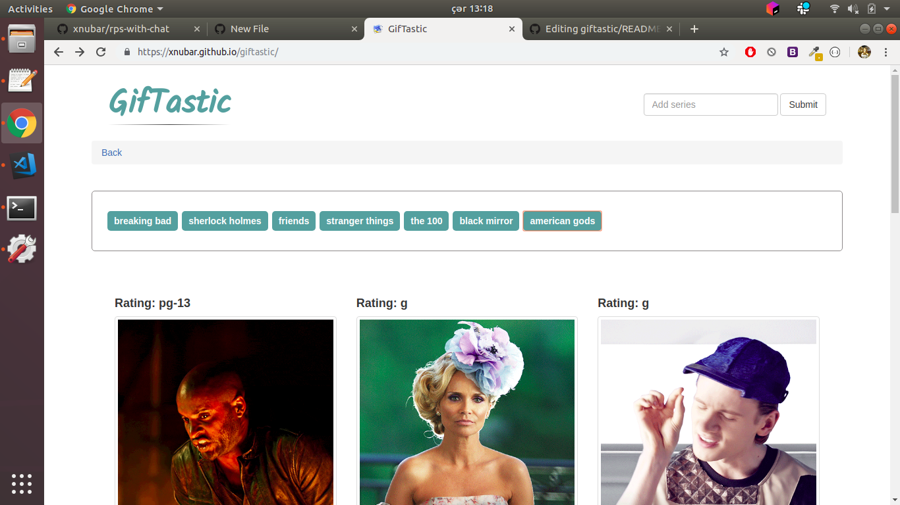

# Giftastic

Initally, menu will be displayed, and you should choose one of the category: animals, films, tv-series:
 
  
 
 After selecting category, options for the category will be shown
 
 
  
 
 When you click one of these options gifs related to the selected option will shown.
  
 
 You can also add your own options:
 
 
 
  
 
 
 When the user clicks one of the still GIPHY images, the gif should animate. If the user clicks the gif again, it should stop playing.  At the top of every gif, display its rating (PG, G, so on).
 
 
 If you want to go back to categories part you must click on Back.
 
 
